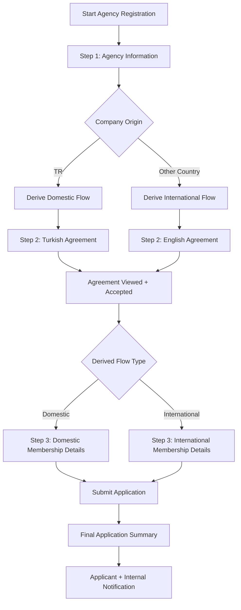

# Business Rule–Driven B2B Agency Onboarding

**Product Management · Business Analysis · Technical Product Ownership**

An anonymized product case study showing how a seemingly simple B2B agency registration requirement was redesigned into a **business-rule-driven, three-step onboarding experience**.

> **Portfolio note:** Company names, sample identities, contact details, identifiers and internal references have been anonymized or replaced with fictional data.

## ▶ Interactive Demo

**[Open the Live Demo](https://alphanakbulut.github.io/business-rule-driven-onboarding/)**  
**[Download the standalone HTML demo](https://raw.githubusercontent.com/alphanAkbulut/business-rule-driven-onboarding/main/index.html)**

The live demo is designed to let a reviewer change the **Company Origin** and observe how the same onboarding entry point produces different downstream behavior.

## The Starting Point

The initial requirement was framed as a standard **new agency registration flow**. At first glance, this looked like a conventional data-collection form: collect agency information, obtain agreement acceptance, collect membership details and submit the application.

During analysis, however, one early input turned out to be much more than a data field:

**Company Origin Country**

The selected country determines which business path the applicant belongs to. Therefore, the same form could not safely behave as one static flow.

## Why the Flow Needed to Behave Differently

A Turkish agency and an international agency enter through the same onboarding journey, but they do not have identical downstream requirements.

For the prototype, the business classification is derived as follows:

- `TR` → **Domestic**
- Any other country → **International**

This classification drives several behaviors behind the UI:

| Decision Area | Domestic | International |
|---|---|---|
| Business classification | Domestic | INT |
| Agreement | Turkish agreement | English agreement |
| Step 3 structure | Domestic membership fields | International membership fields |
| IBAN | Required and validated | Not required / disabled |
| Confirmation language | Turkish | English |
| Final summary | Domestic-specific values | International-specific values |

The key product decision was therefore to **avoid exposing multiple separate registration processes to the customer**. Instead, the customer is guided through one consistent three-step experience while the system adapts the UI, mandatory fields and validations in the background.

## Solution: A Three-Step Adaptive Onboarding Flow



### Step 1 — Agency Information

The first step collects the minimum information required to determine the correct business path.

`Company Origin` is intentionally treated as a **decision input**. Dependent fields remain unavailable until an origin is selected.

The step also captures the registration contact and authorized-signatory information. If both roles belong to the same person, the user can reuse the same data instead of entering it twice.

### Step 2 — Contract / Agreement

The agreement is not treated as a generic checkbox.

The agreement content and language depend on the derived business path. The user must first open/view the agreement before acceptance becomes sufficient to continue.

This separates two concepts that are often incorrectly collapsed into one:

1. **The agreement was presented to the user**
2. **The user accepted the agreement**

### Step 3 — Membership Details

The final data-collection step changes according to the business classification derived in Step 1.

For Domestic applications, the form includes the domestic financial and invoicing requirements, including a required Turkish IBAN.

For International applications, the UI presents the international field set and the IBAN requirement is removed.

The user therefore sees only the fields relevant to the applicable business scenario instead of being presented with a large form full of conditional instructions.

## Completion State

After a successful submission, the three-step wizard is no longer navigable. The onboarding state is replaced by a **Final Application Summary**.

This gives the user a clear transaction boundary:

**Editing → Submission → Completion**

The summary confirms receipt, surfaces the most relevant submitted data, and establishes the information that can also be reused in confirmation notifications.

## What This Case Study Demonstrates

### Product Management

The product problem was reframed from *“build a registration form”* to *“design one onboarding experience that supports multiple business scenarios without increasing customer complexity.”*

Key product decisions include progressive disclosure, minimizing irrelevant fields, maintaining one customer journey, and creating an explicit post-submit completion state.

### Business Analysis

The analysis translates business rules into observable UI behavior:

- decision inputs and dependent fields
- Domestic vs. International branching
- required vs. optional data
- conditional validation
- agreement behavior
- contact/signatory reuse
- submit and completion states

See [`docs/business-rules.md`](docs/business-rules.md).

### Technical Product Ownership

The solution also defines where product behavior needs technical ownership:

- deriving a flow type from business input
- maintaining state across three steps
- separating user-entered data from system-derived values
- aligning frontend behavior with backend validation
- persisting the application before post-submit actions
- designing notification behavior around a successful application lifecycle

See [`docs/technical-product-ownership.md`](docs/technical-product-ownership.md).

## Repository Structure

```text
.
├── index.html                         # Interactive end-to-end prototype
├── application-summary.html           # Standalone completion-state prototype
├── email-template.html                # Email-safe application summary concept
├── docs/
│   ├── business-rules.md
│   ├── product-decisions.md
│   ├── technical-product-ownership.md
│   └── acceptance-criteria.md
├── assets/
│   ├── onboarding-step-1.png
│   └── application-summary.png
├── ANONYMIZATION.md
└── .nojekyll
```

## Scope of the Prototype

This repository is a **product and interaction prototype**, not a production registration service. It demonstrates behavior, state transitions, conditional UI and product decisions. Production concerns such as authentication, persistence, security controls, full server-side validation and mail-delivery infrastructure are intentionally outside the executable demo.
